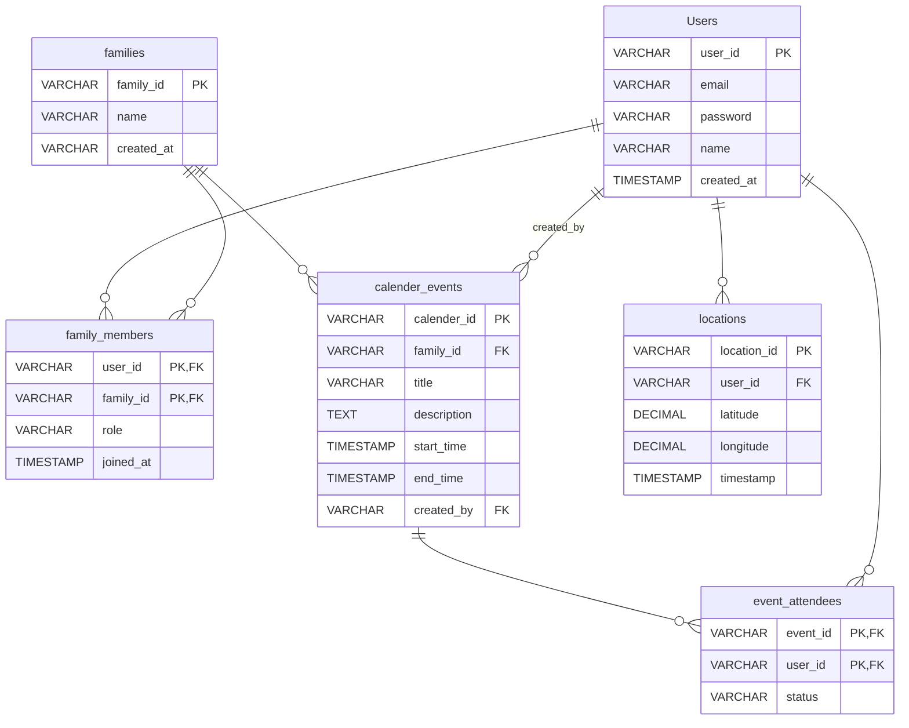

```mermaid
erDiagram
    Users {
        VARCHAR user_id PK
        VARCHAR email
        VARCHAR password
        VARCHAR name
        TIMESTAMP created_at
    }
    family_members {
        VARCHAR user_id PK,FK
        VARCHAR family_id PK,FK
        VARCHAR role
        TIMESTAMP joined_at
    }
    families {
        VARCHAR family_id PK
        VARCHAR name
        VARCHAR created_at
    }
    calender_events {
        VARCHAR calender_id PK
        VARCHAR family_id FK
        VARCHAR title
        TEXT description
        TIMESTAMP start_time
        TIMESTAMP end_time
        VARCHAR created_by FK
    }
    event_attendees {
        VARCHAR event_id PK,FK
        VARCHAR user_id PK,FK
        VARCHAR status
    }
    locations {
        VARCHAR location_id PK
        VARCHAR user_id FK
        DECIMAL latitude
        DECIMAL longitude
        TIMESTAMP timestamp
    }
    Users ||--o{ family_members : ""
    families ||--o{ family_members : ""
    families ||--o{ calender_events : ""
    calender_events ||--o{ event_attendees : ""
    Users ||--o{ event_attendees : ""
    Users ||--o{ locations : ""
    Users ||--o{ calender_events : created_by
```