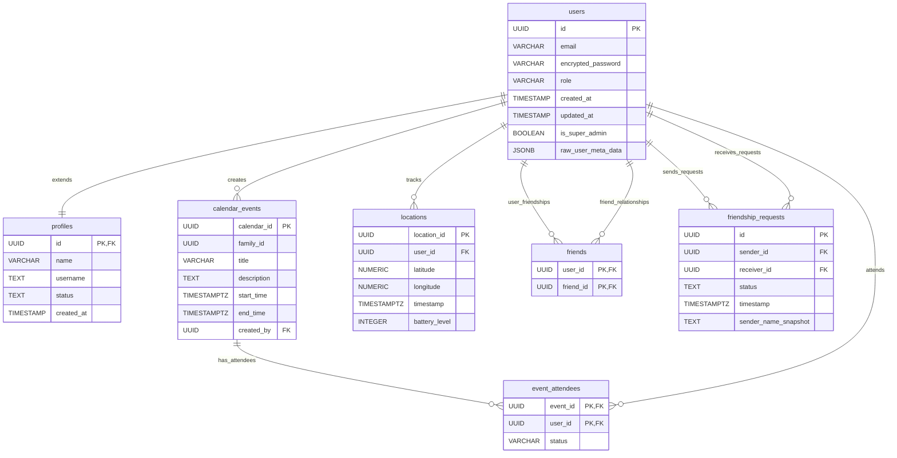

# Family Stalking - APP Ontwikkeling

<h1 align="center">
  <a href="https://www.nhlstenden.com/"></a>
  
</h1>

<p align="center">
  
  
  
  
</p>

## 📱 Projectoverzicht

Family Stalking is een Android-applicatie ontwikkeld als onderdeel van de opleiding Informatica aan NHL Stenden. De applicatie maakt real-time locatietracking van vrienden en familieleden mogelijk, evenementenbeheer en veilige coördinatie van vrienden en familieleden via een intuïtieve mobiele interface.

**Kernfunctionaliteiten:**

- 🔐 Veilige gebruikersauthenticatie met Supabase
- 👥 Vrienden en familiegroepenbeheer met QR-code uitnodigingen
- 📍 Real-time locatietracking en -deling
- 🗺️ Interactieve Google Maps integratie
- 📅 Collaboratieve agenda en evenementenplanning
- 📷 QR-code scanner voor vrienden en familie-uitnodigingen
- ⚙️ Privacycontroles en instellingenbeheer
- 🔔 Push-notificaties voor familie-updates

---

## 🏗️ Architectuuroverzicht

### Clean Architecture Implementatie

De applicatie volgt **Clean Architecture** principes met een duidelijke scheiding van verantwoordelijkheden:

```
app/src/main/java/com/familystalking/app/
├── data/                   # Data Laag
│   ├── datastore/         # Lokale voorkeuren opslag
│   ├── model/             # Data transfer objecten
│   └── repository/        # Repository implementaties
├── domain/                # Domein Laag
│   ├── model/             # Business entiteiten
│   └── repository/        # Repository interfaces
├── presentation/          # Presentatie Laag
│   ├── agenda/            # Kalender en evenementen UI
│   ├── family/            # Familiebeheer UI
│   ├── home/              # Dashboard UI
│   ├── login/             # Authenticatie UI
│   ├── map/               # Kaarten en locatie UI
│   ├── navigation/        # Navigatie configuratie
│   └── settings/          # Instellingen en voorkeuren UI
├── di/                    # Dependency Injection
└── ui/                    # Thema en styling
```

### Architectuurpatronen

- **MVVM (Model-View-ViewModel)**: Reactieve UI met Jetpack Compose
- **Repository Patroon**: Abstractie over databronnen
- **Dependency Injection**: Hilt voor schone dependency management
- **Observer Patroon**: StateFlow/Flow voor reactieve datastromen

---

## 🛠️ Technologie Stack

### Kerntechnologieën

| Technologie         | Versie                | Doel                            |
| ------------------- | --------------------- | ------------------------------- |
| **Kotlin**          | 1.9.22                | Primaire programmeertaal        |
| **Android SDK**     | 34 (Target), 24 (Min) | Platform framework              |
| **Jetpack Compose** | 2024.05.00 BOM        | Moderne declaratieve UI toolkit |
| **Gradle**          | 8.2.2                 | Build automatisering            |

### Backend & Database

| Technologie           | Versie     | Doel                              |
| --------------------- | ---------- | --------------------------------- |
| **Supabase**          | 2.1.3      | Backend-as-a-Service platform     |
| **PostgreSQL**        | (Supabase) | Primaire database                 |
| **Supabase Auth**     | 2.1.3      | Gebruikersauthenticatie           |
| **Supabase Realtime** | 2.1.3      | Real-time data synchronisatie     |
| **Ktor Client**       | 2.3.8      | HTTP client voor API communicatie |

### UI & Navigatie

| Technologie            | Versie      | Doel                     |
| ---------------------- | ----------- | ------------------------ |
| **Jetpack Compose**    | 2024.05.00  | Declaratief UI framework |
| **Navigation Compose** | 2.7.7       | Type-veilige navigatie   |
| **Material Design 3**  | Latest      | Design systeem           |
| **Accompanist**        | 0.31.5-beta | Compose utilities        |

### Locatie & Kaarten

| Technologie                | Versie | Doel               |
| -------------------------- | ------ | ------------------ |
| **Google Maps SDK**        | 18.2.0 | Interactieve maps  |
| **Maps Compose**           | 4.3.3  | Compose-based maps |
| **Play Services Location** | 21.3.0 | Locatie services   |

### Camera & QR Codes

| Technologie | Versie | Doel               |
| ----------- | ------ | ------------------ |
| **CameraX** | 1.4.2  | Moderne camera API |
| **ZXing**   | 3.5.2  | QR code verwerking |

### Dependency Injection

| Technologie                 | Versie | Doel                             |
| --------------------------- | ------ | -------------------------------- |
| **Hilt**                    | 2.50   | Dependency injection framework   |
| **Hilt Navigation Compose** | 1.2.0  | ViewModel injection voor Compose |

### Lokale Opslag

| Technologie               | Versie | Doel                       |
| ------------------------- | ------ | -------------------------- |
| **DataStore Preferences** | 1.0.0  | Type-veilige lokale opslag |

### Code Kwaliteit & Testing

| Technologie | Versie   | Doel                    |
| ----------- | -------- | ----------------------- |
| **ktlint**  | 0.49.1   | Code formatting         |
| **JaCoCo**  | Built-in | Code coverage reporting |
| **JUnit**   | 4.13.2   | Unit testing            |

---

## 📊 Database Schema

De applicatie gebruikt Supabase (PostgreSQL) met de volgende entiteit-relaties:



---

## 📱 Functionaliteiten & Schermen

### Authenticatie Flow

- **Login Scherm**: E-mail/wachtwoord authenticatie met Supabase Auth
- **Registratie Scherm**: Gebruikersregistratie met validatie
- **Wachtwoord Vergeten Scherm**: Wachtwoord reset functionaliteit

### Hoofdapplicatie Flow

- **Home Scherm**: Dashboard met familie-overzicht en snelle acties
- **Kaart Scherm**: Real-time familielid locaties op Google Maps
- **Familie Scherm**: Familielid beheer met QR-code uitnodigingen
- **Agenda Scherm**: Gedeelde kalender met evenement creatie en beheer
- **Instellingen Scherm**: Privacycontroles en app voorkeuren

### Ondersteunende Functionaliteiten

- **QR-code Scanner**: Camera-gebaseerd familie-uitnodigingssysteem
- **Lopende Verzoeken Scherm**: Beheer familie-deelnameverzoeken
- **Evenement Toevoegen Scherm**: Creëer en plan familie-evenementen

---

## 🚀 Aan de Slag

### Vereisten

Zorg ervoor dat je het volgende geïnstalleerd hebt:

- **Java Development Kit (JDK)**: Versie 17 of hoger
- **Android Studio**: Laatste stabiele versie (Hedgehog 2023.1.1 of nieuwer)
- **Android SDK**: API Level 34 (Android 14)
- **Git**: Voor versiebeheer
- **Kotlin**: 1.9.22 (automatisch beheerd door Gradle)

### Omgeving Instellen

1. **Repository Klonen**

   ```bash
   git clone https://github.com/NHL-P4-INF2-APD/family-stalking.git
   cd family-stalking
   ```

2. **Lokale Configuratie Aanmaken**

   Maak een `local.properties` bestand aan in de projectroot:

   ```properties
   # Vereist: Supabase Configuratie
   SUPABASE_URL=your_supabase_project_url
   SUPABASE_ANON_KEY=your_supabase_anon_key

   # Vereist: Google Maps API Key
   GOOGLE_MAPS_API_KEY=your_google_maps_api_key
   ```

3. **Project Importeren in Android Studio**

   - Open Android Studio
   - Selecteer "Open an Existing Project"
   - Navigeer naar de gekloonde directory
   - Wacht tot Gradle sync voltooid is

4. **API Keys Configureren**

   **Supabase Setup:**

   - Maak een project aan op [supabase.com](https://supabase.com)
   - Ga naar Settings > API
   - Kopieer de Project URL en anon public key

   **Google Maps Setup:**

   - Bezoek [Google Cloud Console](https://console.cloud.google.com)
   - Schakel Maps SDK voor Android in
   - Maak een API key aan
   - Beperk de key tot jouw app's pakket naam

### Project Bouwen

```bash
# Bouw debug APK
./gradlew assembleDebug

# Bouw release APK
./gradlew assembleRelease

# Installeer debug build op aangesloten apparaat
./gradlew installDebug
```

---

## 🧪 Code Kwaliteit & Testing

**Code Style Handhaving:**

- 4-spatie inspringing
- 120-karakter regel limiet
- Kotlin officiële code conventies
- Geen wildcard imports
- Consistente naamgevingsconventies

### Testing

**Unit Tests:**

```bash
# Voer alle unit tests uit
./gradlew testDebugUnitTest

# Voer uit met coverage
./gradlew coverage
```

**Code Coverage:**

- **JaCoCo** integratie voor uitgebreide coverage rapporten
- Sluit auto-gegenereerde bestanden uit (R.class, BuildConfig, etc.)
- HTML en XML rapporten gegenereerd in `app/build/reports/`

### Kwaliteitspoorten

Het project handhaaft:

- **Minimum code coverage**: Configureerbare drempelwaarde
- **Nul kritieke Detekt overtredingen**
- **Alle unit tests slagen**
- **Juiste ktlint formatting**

---

## 📦 CI/CD Pipeline

### GitHub Actions Workflow

De geautomatiseerde pipeline omvat:

1. **Code Kwaliteitscontroles**

   - Detekt statische analyse
   - ktlint formatting verificatie
   - Unit test uitvoering

2. **Build Proces**

   - Gradle build verificatie
   - APK generatie voor releases

3. **Testing**

   - Unit test uitvoering
   - Code coverage rapportage
   - Integratie test uitvoering

4. **Artifacts**
   - Debug/Release APK bestanden
   - Test rapporten
   - Coverage rapporten

### Release Proces

Releases worden automatisch getriggerd op versie tags:

```bash
git tag v1.0.0
git push origin v1.0.0
```

---

## 🔧 Configuratie

### Gradle Configuratie

**Root `build.gradle.kts`:**

- Kotlin versie: 1.9.22
- Android Gradle Plugin: 8.2.2
- Hilt: 2.50

**App `build.gradle.kts` highlights:**

- Compile SDK: 34
- Target SDK: 34
- Min SDK: 24
- Java compatibiliteit: 17
- Jetpack Compose ingeschakeld
- BuildConfig generatie ingeschakeld

### Permissies

Vereiste Android permissies:

```xml
<uses-permission android:name="android.permission.INTERNET" />
<uses-permission android:name="android.permission.ACCESS_FINE_LOCATION" />
<uses-permission android:name="android.permission.ACCESS_COARSE_LOCATION" />
<uses-permission android:name="android.permission.CAMERA" />
```

### Dependency Injection

**Modules:**

- `SupabaseModule`: Configureert Supabase client
- `RepositoryModule`: Bindt repository implementaties
- `DataStoreModule`: Voorziet DataStore instanties
- `LocationModule`: Configureert locatie services

---

## 🔒 Beveiliging & Privacy

### Gegevensbescherming

- **End-to-end authenticatie** via Supabase Auth
- **Veilig token beheer** met automatische vernieuwing
- **Locatiedata encryptie** tijdens transport
- **Privacycontroles** voor locatie deling

### Best Practices

- **Input validatie** op alle gebruikersinvoer
- **SQL injection preventie** via geparameteriseerde queries
- **XSS bescherming** door juiste data sanitisatie
- **Veilig API key beheer** via BuildConfig

---

## 📈 Performance Overwegingen

### Optimalisaties

- **Lazy loading** van locatiedata
- **Efficiënte afbeelding caching** voor profielfoto's
- **Achtergrond locatie updates** met batterij optimalisatie
- **Compose recomposition optimalisatie**
- **Database query optimalisatie** met indexes

### Geheugen Beheer

- **Juiste lifecycle awareness** in ViewModels
- **Coroutine scoping** om geheugen lekken te voorkomen
- **Efficiënte bitmap verwerking** in camera functionaliteiten
- **StateFlow gebruik** voor reactief programmeren

---

## 🐛 Probleemoplossing

### Veelvoorkomende Problemen

**Build Fouten:**

```bash
# Schoon en herbouw
./gradlew clean
./gradlew build
```

**Locatie Services Werken Niet:**

- Controleer of Google Play Services geïnstalleerd zijn
- Controleer locatie permissies in apparaat instellingen
- Zorg ervoor dat GPS ingeschakeld is

**Supabase Verbindingsproblemen:**

- Controleer API keys in `local.properties`
- Controleer netwerkconnectiviteit
- Valideer Supabase project configuratie

**Kaarten Laden Niet:**

- Controleer Google Maps API key
- Controleer API key restricties
- Zorg ervoor dat Maps SDK ingeschakeld is in Google Cloud Console

## 👥 Ontwikkelteam

- **Bram Suurd** -
- **Bryan Potze**
- **Yunus Karakoç**

---

## 📞 Project Links

- 📚 **Documentatie**: Deze README en inline code documentatie
- 🔄 **CI/CD**: GitHub Actions voor geautomatiseerde builds en testing

---

## 🎓 Academische Context

**Instelling**: NHL Stenden Hogeschool  
**Opleiding**: Informatica  
**Vak**: App Development
**Studiejaar**: 2024/2025
**Project Type**: Team-gebaseerde software ontwikkeling met nadruk op:

- Scrum ontwikkelingsmethodologieën
- Code kwaliteit en test praktijken
- Professionele ontwikkelingsworkflows
- Moderne Android ontwikkelingstechnieken
